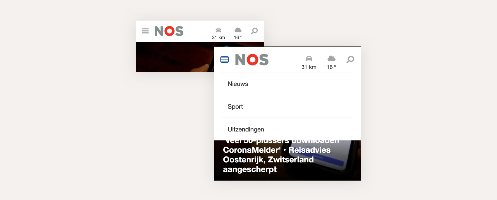

# Procesverslag
**Auteur:** -Job Lamp-

Markdown cheat cheet: [Hulp bij het schrijven van Markdown](https://github.com/adam-p/markdown-here/wiki/Markdown-Cheatsheet). Nb. de standaardstructuur en de spartaanse opmaak zijn helemaal prima. Het gaat om de inhoud van je procesverslag. Besteedt de tijd voor pracht en praal aan je website.

## Bronnenlijst

1. Button syle verwijderen
https://stackoverflow.com/questions/2460100/remove-the-complete-styling-of-an-html-button-submit

2. Hamburger menu
https://www.w3schools.com/howto/howto_js_mobile_navbar.asp

3. H1 hidden
https://wdn.unl.edu/page-title-h1-best-practices#:~:text=You%20can%20visually%20hide%20the,available%20to%20AT%20and%20bots

4.How to centre a html5 section element? verticaly
https://stackoverflow.com/questions/13964280/how-to-centre-a-html5-section-element-verticaly

5. How do I vertically center text with CSS? [duplicate]
https://stackoverflow.com/questions/8865458/how-do-i-vertically-center-text-with-css

6. Align image in center and middle within div
https://stackoverflow.com/questions/4888223/align-image-in-center-and-middle-within-div

7. CSS background image won't scale
https://stackoverflow.com/questions/29180399/css-background-image-wont-scale

8. How do I remove the space between inline/inline-block elements?
https://stackoverflow.com/questions/5078239/how-do-i-remove-the-space-between-inline-inline-block-elements

9. Is using <li> without enclosing <ul> tags dangerous? [closed]
https://stackoverflow.com/questions/2031725/is-using-li-without-enclosing-ul-tags-dangerous

10. How to overlay one div over another div
https://stackoverflow.com/questions/2941189/how-to-overlay-one-div-over-another-div

11. Fixed footer that won't go past bottom of content
https://stackoverflow.com/questions/11278377/fixed-footer-that-wont-go-past-bottom-of-content

## Eindgesprek (week 7/8)

## Voortgang feedback met Sam Slotemaker
Op het eerste oog is hij in ieder geval redelijk in orde! Qua css komt het in iedergeval goed neem ik aan. 
Qua html ben je ook goed op weg, alleen zijn er een paar dingen die je iets anders kunt doen. Zo mist je pagina bijvoorbeeld een h1, ik zou altijd aanhouden om 1 h1 per pagina te gebruiken, zelfs als deze niet zichtbaar is: 
https://wdn.unl.edu/page-title-h1-best-practices#:~:text=You%20can%20visually%20hide%20the,available%20to%20AT%20and%20bots.
 
Let ook op het verschil tussen anchors (<a>) en buttons. Je hamburger menu is bijvoorbeeld nu een anchor, terwijl deze eigenlijk een button zou moeten zijn. een anchor verwijst naar een andere pagina, of een ander deel op de pagina (zoals een link die naar een section onderop scrollt) en een button triggert een actie, zoals in dit geval zo is bij het hamburger menu.
 
Wat ik ook even zou doen, is je code door de w3 validator halen. Hiermee kun je bepaalde errors in je html spotten die zelf moeilijk te zien zijn. Zo heb je bijvoorbeeld een div tag in een ul en li tag, en heb je sommige ID's vaker gebruikt op een pagina. ID's zijn uniek, deze kun je niet hergebruiken. 
https://validator.w3.org/nu/?doc=https%3A%2F%2Fjoblamp.github.io%2FFrontend2020%2F
 
Probeer ook je css in te delen met comments, maak een enigszins logische indeling voor jezelf en anderen, scheid doormiddel van comments de header van de main content en zo voorts. 
 
kleinigheidje dat ik nu nog zie, de aanmeld button zit niet in het formulier, deze is gewoon onderdeel van het formulier, normaal gesproken zou de button het formulier namelijk submitten. 
 
Zonder erg diep in je code te duiken ziet het er verder goed uit, lijkt er op dat het wel goed moet komen.

### Stand van zaken
#### De Navigatie
Ik begon mijn FED opdracht met het maken van de mobiele navigatie op de homepage. Ik ga beginnen met de homepage omdat ik denk dat deze het ingewikkeldste in elkaar zit omdat er heel veel verschillende aspecten voorkomen op allerlei kleinere stukjes. De nieuws artikel page heeft meer grotere vlakken waar ik mee kan werken. 
Het was behoorlijk lastig inkomen met het maken van de navigatie. Ik heb al drie jaar geen frontend of coderen gedaan en ik ben er ook niet bepaald thuis in. Het duurde mij twee dagen aan mijn code om een goede navigatie bar te krijgen, zonder werkend hamburger menuutje. Ik moet telkens de stof van FED doorspitten zoals: ‘Learn CSS Position In 9 Minutes’ en ‘What the Flexbox?’ Om een beetje te mijn positionering goed te krijgen. Dit lukte wel maar de logica ontbrak nog, wellicht later in het maken van de webpagina.

#### De Voorpagina nieuws
Tijdens het coderen van de de twee ‘voorpagina’ artikel thumbnails, werd het principe van positionering veel duidelijker voor mij. Ik kreeg in de gaten dat de {position} property zeer belangrijk is wanneer je de elementen of selectoren wilt verplaatsen in de code. Dit had ik eerst nooit door en daarom vond ik het vroeger ook zo vaag denk ik. Ik moet nog even wennen om de position property constant te gebruiken, maar het zaadje is geplant. Ik had ook erg veel moeite met het plaatsen van een Div boven, of onder, en andere Div. Blijkbaar heb je de property: {z-index} nodig om de nodige selectors een waarde te geven. De selector met de hoogste waarde staat ‘voor’ de andere selector met een mindere waarde. Dit was een pittig stuk in de code maar na een dag stoeien was het uiteindelijk gelukt.

#### De artikelen
Steeds meer krijg ik de positionering onder de knie. Ik zet de position property vaker in de css per selector en het verschuiven van selecteren gaat ook steeds beter. Met dit deel van de website kon ik goed oefenen met flexbox. Ik moet dus een lange verticale lijst maken met alle artikelen, wat met ‘flex-direction’ en dan ‘column’, goed lukt. En per artikel moet ik de elementen weer horizontaal neerzetten, waar ik dus ‘row’ gebruikte bij de ‘flex-direction’. Dit was een met veel trail and error uiteindelijk goed gekomen. Ik merk dat het basis coderen steeds logischer wordt als ik mijn tijd ervoor neem. Zonder druk is het coderen op momenten prima te doen, al vind ik het nog steeds behoorlijk lastig.

#### De Aside
De ‘aside’ was me toch een gepriegel. In eerste instantie lijkt het heel gemakkelijk, het is een klein stukje van de website met maar drie ‘li’ selectors in één ‘ul’, nog een kopje erboven en klaar. Maar niks was minder waar. De drie ‘li’ zijn aan de kleine kant en er gebeurt best veel binnen elk stukje. Er moet een logo/img in, een kopje met daaronder een tekstje in een ‘p’ tag en nog een icon naast. Ik wist dat de basis van deze uitdaging bij de ‘position’, en de ‘flex-boxen’ lag. Maar ik moest goed kijken welke spacing ik moet gebruiken, hoe ik de juist content links of recht kon laten staan, met de kop en de ‘p’ toch nog onder elkaar. Het was pittig maar het voelde wel dat ik de spacing logisch kon linken aan de positionering in mijn code. Het is gelukt, nu alleen de Hoover States nog.

#### De Hamburger menu
Het opzetten van de icon voor de hamburgermenu ging opzich wel prima. Maar later wilde ik hem werkende hebben zodat deze echt functioneel werkt. Waar je op het icoon druk en dan verschijnt er een navigatie menu onder. Het was even stoeien, zeker met het begrijpen van de logica in de script.js. Maar doormiddel van hulp van w3schools (https://www.w3schools.com/howto/howto_js_mobile_navbar.asp) Werd het wel gemakkelijk gemaakt. Ik moest met de css aan de slag om het menu precies te krijgen zoals ik wou. Weer zag ik dat position een krachtige tool is om gecontroleerd de elementen te verschuiven en te veranderen. Ik had wel problemen met het menuutje dat het achter de content van de volgende secties bleef hangen. Ik probeerde eerst de dropdown menu bij die secties te zetten, zodat het er niet onder zou zitten, maar dan was de dropdown code heel ver weg van de oorspronkelijke nav plek. Toen zat ik dat ik met z-index de dropdown naar voren kon brengen en kon ik de codes bij elkaar houden.

#### De promotie stukjes
Het promotie stuk onder in de pagina over de verschillende kanalen duurde veel langer dan nodig was. Dit stuk lijkt veel op de voorpagina artikelen, bovenin de pagina. Maar de spacing is net even anders. Dit vind allemaal nog maar de content op de voorgrond van de foto moest onderin de Parent container plaatsvinden en dat deed de content niet, het bleef boven in de pagina zitten. Ik weet dat je bijvoorbeeld bottom: 0; kunt toepassen aan de Parent en dat de content dan naar onder zakt, dat werkte dus niet. Ik heb heel lang gezocht naar een oplossing en het bleek dus dat ik bij 1 div een waarde was vergeten in te vullen. Toen ik deze invulde klikte alles meteen op zijn plaats.

#### News.html
Het maken van de news.html ging behoorlijk soepel. De moeilijkste elementen van de website waren al gemaakt in de homepage, wat ik verwachte, en het maken van een artikel ging erg goed. Liep niet echt ergens tegenaan. 

## Intake (week 1)

**Mijn startniveau:** Blauw

**Mijn focus:** een extra verzorgde surface plane.

**Mijn opdracht:** https://nos.nl/ Homepage en nieuws artikel page

**Screenshot(s):** (images/NOSmobile.png) (images/NOStablet.png) (images/NOSweb.png)

**Breakdown-schets(en):** (images/NOS-breakdown1.jpg) (images/NOS-breakdown2.jpg) (images/NOS-breakdown3.jpg)

